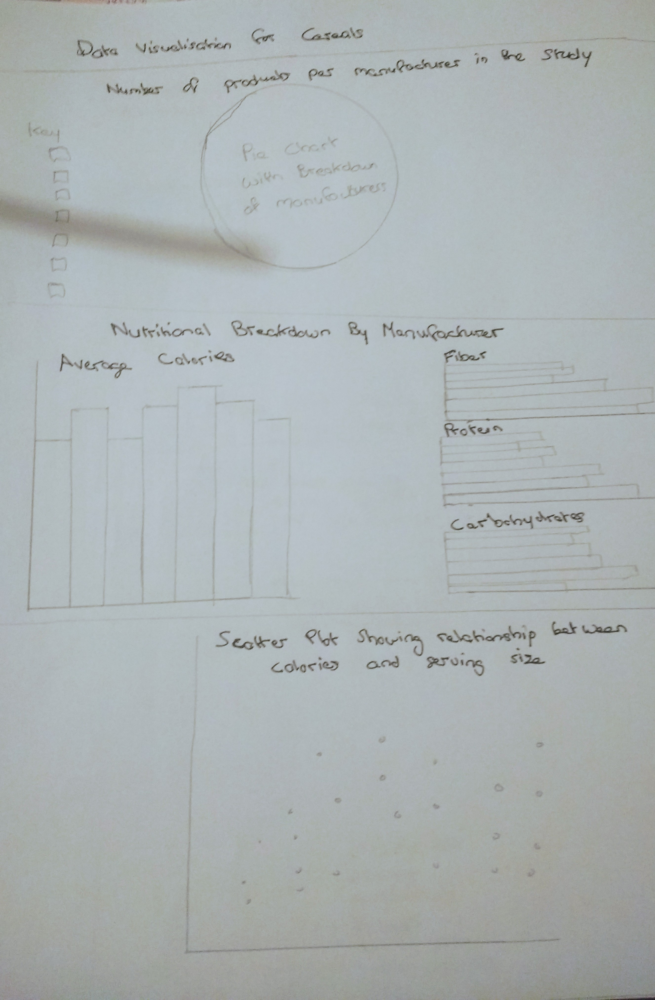
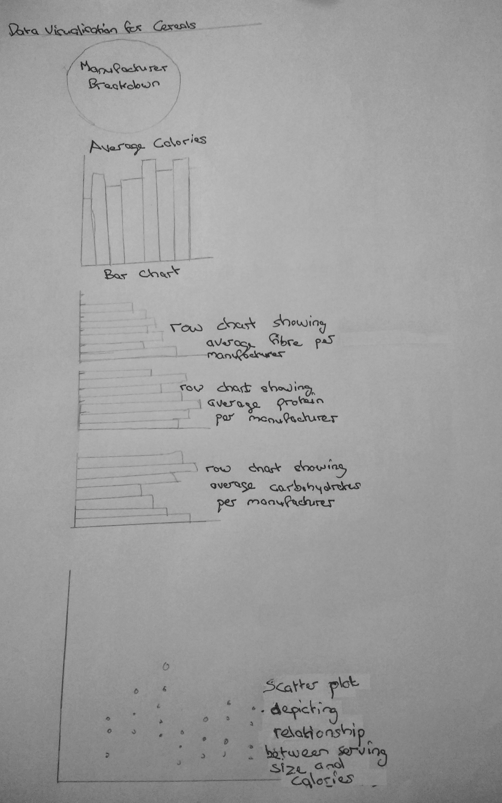

# Cereal Data Dashboard Milestone 2 Project
This project was created as an End of Module Project for the Code Institute. The option I chose 
was to build a data dashboard visualising a dataset containing details of seven breakfast
cereal manufacturers (USA based). It was built using the DC, D3, Crossfilter and Queue libraries. 

## UX
My dashboard attempts to achieve its goal by displaying the charts in an easily digestible layout. It is a single
page application with a fixed-top navbar is always visible on the page and contains links to the various 
sections within the dashboard. 
It is also possible to navigate through the site using the mousepad or arrow keys on a laptop or desktop. The site
provides information for users regarding nutritional content of the various cereals and is grouped by manufacturer.
The charts can be filtered based on manufacturer. The select menu at the top to find out provides the user with
the opportunity to select a cereal of their choice and examine its nutritional content.

##### User Stories
* As someone who eats cereal for breakfast, I would like to visit this site to find out which manufacturer's
products contain the most calories.

* As someone who usually skips breakfast, I would like to visit this site to find out more about the 
potential products available to me.

* As someone who has cereal for breakfast, I would like to visit this site to find out more about the 
average nutritional content of some popular cereal brands.

* As someone who normally eats toast for breakfast, I would like to visit this site to find out about 
alternative options available to me.

* As someone who usually eats Corn Flakes for breakfast, I want to visit this site to find out more about 
its nutritional content

#### Wireframes

* Desktop Dashboard 
* Mobile Dashboard 

## Features

#### Existing Features

This Dashboard is a Single Page Application with a navbar at the top which allows the user to navigate to 
the section of their choice. The first feature that the user arrives at is a select menu which allows them
to choose their favourite cereal and filter the charts based on that result.
The next section contains a pie chart with and interactive legend and provides information regarding the number
of products each manufacturer has. The next chart is a bar chart displaying the average calorie content in the 
cereals. Continuing on down the page there are six row charts detailing the average protein, fibre, 
carbohydrate, sodium, fat and sugar contained in the cereals.
The final chart is a scatter plot looking at the correlation between serving size and calorie content of
each cereal. By hovering over a particular dot, the user is given information regarding cereal name, its calorie
content and recommended serving size. 
Unfiltered each bar, row and segment of the charts represent a particular manufaturer. The charts can be 
filtered by clicking on the relevant section of the chart or selecting a manufacturer in the
pie chart legend. 

#### Features Left to Implement

## Technologies Used
* HTML5
    * used to structure and add content to the site
* CSS3 & Bootstrap
    * used to style the page

* JavaScript / jQuery, for interactivity

* D3.js, DC.js, Crossfilter.js, Queue.js
    * javascript libraries used to visualise, explore and filter datasets

* Font Awesome
    * icons used in footer

## Testing
I validated my HTML using the W3C validator. I received no errors or warnings.
My CSS file was checked using the W3C CSS Validation service I received no errors or warnings 

    

I tried to make sure that the containers were as responsive as possible without sacrificing chart quality. 
For this reason, my dashboard is best viewed on tablet, laptop or desktop computers. I checked that the charts 
filtered correctly, the select menu worked as it should and that the navigation and font awesome links were 
functional and opened in a new tab. I also tested the reset button to make sure it returned all charts to an 
unfiltered state. 

The dashboard was tested using the criteria on the following browsers:
* Firefox
* Chrome
* Microsoft Edge
* Opera

It was also tested using those criteria on the following devices: 
* Galaxy S9/ S9+ 
* Galaxy Note 9 
* iPhone 6, 7, 8
* iPhone 6, 7, 8 plus 
* iPad
* iPad Mini
* iPad pro 10.5 
* Kindle Fire HDX
* Laptop with HiDPI screen
* Laptop with MDPI screen
* Laptop with touch
* 720p HD Television
* 1080p Full HD Television

The only small issue I had was rendering the tooltips on the scatterplot points for touch screens. I didn't
manage to fix this but have noticed the same problem on other websites when examining scatter plots in 
responsive mode. 
As well as this, my scatter plot while still readable, isn't aesthetically pleasing on mobile screens due
to the fact that I hard coded the height attribute and used a responsive width attribute. I chose to do this over using 
viewbox resizing because when I used viewbox resize either one or both of the axis lines on my chart disappeared, and no matter
how much I played around with the margins I could not get it to display properly on all mobile screens. 
For this reason, I felt using a dynamic width was the best way to have responsive graphs without losing out on any of the 
details. 

## Deployment
This site was created in the Cloud9 IDE. I used git for version control. The code was then pushed to the GitHub master branch and deployed using GitHub Pages.
The live site can be found [here:](https://libbyh52.github.io/Cereal-Data-Dashboard/)
Local deployment was not used for this project.

## Credits

#### Content
The dataset I used for analysis was obtained from [kaggle.com](https://www.kaggle.com/crawford/80-cereals/).
The full names of the breakfast cereal manufacturers were also obtained from
[kaggle.com](https://www.kaggle.com/jeandsantos/breakfast-cereals-data-analysis-and-clustering).
The code for rotating the text on my bar chart I got from [JS fiddle](https://jsfiddle.net/geotheory/mvhtqu17/).
CSS code for removing the tick marks on the bar chart was taken from the fourth answer (Andrew) [JSFiddle](https://github.com/c3js/c3/issues/876).
The colour scheme for my charts, borders, header and footer was gotten from 
[learnui](https://learnui.design/tools/data-color-picker.html#palette)
The code for resetting the charts from their filtered state was also obtained from [jsfiddle](http://jsfiddle.net/gordonwoodhull/yu1swf2x/1/)
I got the code for my navbar from [bootswatch](https://bootswatch.com/pulse/). The only change I made was to
remove the 'expand' class as I wanted a collapsed navbar on all screen sizes.
The JavaScript code to collapse the Hamburger menu was copied from [stackoverflow](https://stackoverflow.com/questions/16877429/twitter-bootstrap-mobile-nav-hide-menu-after-clicking-menu-link).

#### Media
The cereal image in my Navbar I got from [pixabay](https://pixabay.com/en/cereal-breakfast-milk-bowl-healthy-32149/).

#### Acknowledgements
My layout was inspired by [the following data visualisation](http://amberonrails.com/cereal-visualization/).
and by the Code Institute's Data Visualisation Mini Project.

